# HaloWars-DE-TrueSkill

**Competitive TrueSkill & CSR ratings, leaderboards, and match history for Halo Wars: Definitive Edition (Microsoft Store).**

🌐 **Live ladder: [halo-wars-definitive-edition-stats.pages.dev](https://halo-wars-definitive-edition-stats.pages.dev)** — leaderboards, player pages, and recent games from the current ranked community, updated automatically.

> ### ⬇️ [Download v1.1.4 — the community leaderboard, built in](../../releases/latest)
> Unzip, double-click `Install Auto-Load.bat` once, play. No terminal, no administrator rights — see [Installation](#installation).
> On first launch the overlay downloads the community match history and the leaderboards fill themselves in; your own finished matches upload automatically. To be **rated**, press *Request to join* on the Verified Roster tab (see [Joining the ladder](#joining-the-ladder)). Prefer a purely local tracker? Delete the two `sync_` lines from `ms_trueskill_config.txt` and nothing is ever uploaded.

### What each update did

- **v1.1.4** — the UNRANKED badge now names *every* player keeping a match out of the ratings, not just the first one.
- **v1.1.3** — the lobby rank icons switch on instantly instead of needing a restart, and other players' games show up on the leaderboard up to 6× sooner.
- **v1.1.2** — fixed settings and community sync silently failing when the install path contains non-English characters.
- **v1.1.1** — startup diagnostics for the in-game rank icons, so a failure to draw them can be traced.
- **v1.1** — the community leaderboard built in: the shared match history downloads on first launch and your games upload automatically.
- **v1.0** — first public release: TrueSkill and CSR ratings, match history, and in-game rank icons.

Full notes for each version are on the [Releases](../../releases) page. Updating is simple: uninstall the old copy, delete the folder, download the new one — see [Updating](#updating). Your ratings and match history are never at risk; they are not kept in that folder.

## Why this exists

The original Halo Wars (2009) was built around a **TrueSkill™-powered ranked ladder** — skill ratings, a public leaderboard, and the climb was half the game. When **Halo Wars: Definitive Edition** was released, that entire system went with it. What DE tracks instead is a **monthly wins count** — and that is the whole of it: no skill rating, no per-match history, and it wipes every month. **This project is a rebuild of that ranked experience** for the Microsoft Store version — an in-game overlay backed by a community ladder, restoring what Definitive Edition left out and modernizing it with TrueSkill 2.

This ladder is built for — and used by — the **high-level Halo Wars: DE competitive community**: the players still competing seriously are the ones being rated on it.

Every feature below exists for a reason — either something the original game had and Definitive Edition dropped, or something DE has been getting wrong since launch. Each one says which.

---

## Features

### 🏆 Skill ratings & leaderboards
- **TrueSkill™** ladder — the same rating model used by Xbox Live matchmaking, tracked per game type (1v1 / 2v2 / 3v3 / Deathmatch).
- **TrueSkill 2 (CSR)** ladder — **the recommended system** — a Competitive Skill Rank powered by our from-scratch rewrite of Microsoft Research's TrueSkill 2 algorithm, with Halo-style tiers: Bronze → Silver → Gold → Platinum → Diamond → **Onyx**, plus a **Champion** accolade for the top of the board.
- Two rank display styles, switchable in-game: modern **tier emblems** or the classic **Halo 2 1–50** numbered ranks.
- Monthly wins boards alongside the lifetime skill ladders.

**Why:** This is the part Definitive Edition took away. All DE ranks you on is **wins this month** — a board that measures how much you played rather than how well, that a grinder tops over a better player, and that wipes clean every month so nothing you do accumulates into anything. The 2009 game had a real TrueSkill ladder and a public leaderboard, and the competitive community has wanted it back ever since — a ranked scene with nothing to rank is just customs. So the ladder is rebuilt on the rating model the original ran on, with **TrueSkill 2** — the algorithm behind modern Halo ranked play, and the one **Halo Wars 2** shipped its own Bronze-to-Champion CSR on — as the main board, so the climb means what it used to and the math is better than it was. The monthly wins boards are kept too, since that is the one board DE players already have; here they simply sit next to a rating that measures skill and never resets.

### 📜 Match history
- Every ranked game recorded automatically: map, teams, leaders, scores, duration, and per-player rating changes.
- Rich in-overlay match cards with map thumbnails, leader portraits, and result icons — filter by game type, playlist, map, or player.

**Why:** DE counts your wins for the month and keeps nothing else — not who you beat, not what you played, not how it went. The individual game leaves no trace: the post-game screen is the only place the result ever exists, and once you leave it, it is gone — no history, no head-to-head, no way to see where a rating change came from. A ladder nobody can audit is a ladder nobody trusts, so every rated game is stored in full: the receipts for each rating movement, and a record of the community's competitive history that outlasts the session it happened in.

  &nbsp;
  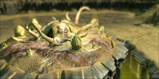&nbsp;
  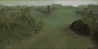&nbsp;
  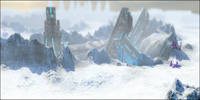

  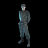&nbsp;
  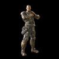&nbsp;
  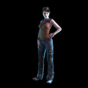&nbsp;
  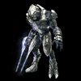&nbsp;
  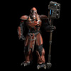&nbsp;
  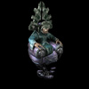

*The map art and leader portraits used on the match cards.*

### 🎖️ In-game rank icons
- The game itself draws rank art next to players in the **pre-game lobby and the in-match scoreboard** — your opponents' ranks visible at a glance, using the classic 1–50 numerals.

**Why:** Because showing it off *is* the point. A rank nobody else can see is a private statistic, and private statistics have never made anyone queue one more game — the flex is what a ladder actually runs on. A leaderboard on a website is not the same thing: the moment that matters is the lobby, when everyone loads in and sees exactly who they are sitting across from. So the rank is drawn in the game itself, next to every player in the pre-game lobby and the in-match scoreboard. You wear yours, you see theirs, and it lands before the first base goes down — in DE's own lobby every player looks identical whether they are on their tenth game or in the top ten.

### 🌐 PC ↔ Xbox custom lobbies
- Cross-play custom-game lobbies between PC (Microsoft Store) and Xbox players: search for Xbox-hosted lobbies and advertise your own PC lobby to Xbox friends.

**Why:** Halo Wars: DE has had cross-platform problems since the day it launched — PC and Xbox players have never been able to reliably find each other's games, and the two halves of the community ended up playing separately. That split hurts far more than it would in a big game: the active competitive population is small, and cutting it in two makes a full lobby harder to fill on both sides. This makes PC and Xbox lobbies visible to each other so the community can play as one pool again.

### ⚡ FPS cap control
- Raise the game's frame-rate cap: 60 / 120 / 240 / 360 FPS, plus a built-in frame-rate meter. No config files, one hotkey.

**Why:** The frame-rate cap is the part of this game that has aged worst. Even 120 FPS is well short of what a current GPU and a 144/240/360 Hz monitor will comfortably do on a title this old — a 2009 game is not what is straining your PC — and the difference shows immediately in camera panning and unit movement. The hardware is not the limit here; the cap is. So the cap is exposed directly — one hotkey, no config-file editing — with a frame-rate meter to confirm the new one actually took.

---

## How the ratings work

Two rating systems run side by side over the same match history. Both are *earned in real matches only* — there is no placement quiz, and ratings can't be edited by anyone, including us.

**Why two:** classic **TrueSkill** is kept because it is exactly what the 2009 ladder ran on — a large part of the point here is that the original rating still exists and still means what it meant. **TrueSkill 2** is the recommended board because it is what Microsoft built after a decade of actually running TrueSkill on Halo: by its own paper it settles on a player's real level in fewer games and predicts results more accurately, and it is the model behind modern Halo ranked play. Neither is an invention of ours — both are published Microsoft Research systems implemented from the papers, so the ladder can be checked rather than taken on trust.

### TrueSkill™

TrueSkill models every player with two numbers: an estimated skill **μ** and an uncertainty **σ**. The number shown on the ladder is the **conservative estimate** (μ − 3σ) — skill the system considers *proven*, not just guessed. That has two visible effects:

- **New players start at 1** and climb quickly: while your uncertainty is high, every result teaches the system a lot, so your first games move your rating fast.
- **Established players move slowly**: after many games the system knows your level, so a single win or loss shifts you only a little.

### TrueSkill 2 (CSR)

CSR runs on **TrueSkill 2** — the successor algorithm Microsoft designed for modern Halo ranked play, and the system **Halo Wars 2 launched with**: a TrueSkill 2 CSR running Bronze to Champion. Our engine is a **from-scratch rewrite implemented directly from the published research paper** ([*TrueSkill 2: An improved Bayesian skill rating system* — Minka, Cleven & Zaykov, Microsoft Research, 2018](https://www.microsoft.com/en-us/research/publication/trueskill-2-improved-bayesian-skill-rating-system/)), running the full Bayesian factor-graph update, not an approximation. Both the paper and the math are published right here in this repo: a faithful Markdown transcription of the full paper ([reference/TRUESKILL2_PAPER.md](reference/TRUESKILL2_PAPER.md)) and the MIT-licensed **Python reference implementation** ([reference/trueskill2/](reference/trueskill2/)) that the in-game engine is verified against — the two agree to ~1e-13, so anyone can check the ladder's math. **This is the recommended rating system** — the one we use as the main competitive ladder — and it maps skill onto the **same Bronze-to-Champion tiers Halo Wars 2 shipped with**. That is deliberate: this game's own sequel already settled what a Halo Wars rank looks like, so Definitive Edition gets that ladder rather than something invented here. Each tier below Onyx has six sub-ranks of 50 CSR each:

| Tier | CSR range |
|---|---|
| 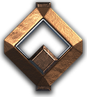 **Bronze 1–6** | 0 – 299 |
| 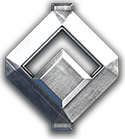 **Silver 1–6** | 300 – 599 |
| 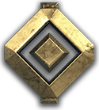 **Gold 1–6** | 600 – 899 |
|  **Platinum 1–6** | 900 – 1199 |
| 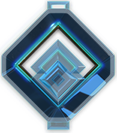 **Diamond 1–6** | 1200 – 1499 |
| 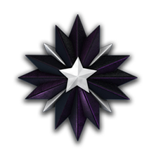 **Onyx** | 1500+ (shows your exact CSR) |
| 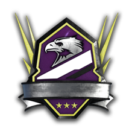 **Champion** | Top ten on the leaderboard at 1780+ |

*The actual tier emblems the overlay and leaderboards display.*

Everyone starts at CSR 0 with maximum uncertainty. Like TrueSkill, early games move you hundreds of CSR at a time while the system finds your level; once established, a typical match moves you a few dozen. **Champion is not a CSR threshold you can camp** — it is an accolade worn by the **top ten players who have also reached 1780 CSR**, recalculated as the leaderboard changes. Both conditions apply: 1780 alone does not crown you if eleven people sit above you, and a top-ten seat does not crown you below 1780. A Champion is still Onyx-rated underneath. (1780 is also where rank 48 opens on the 1–50 ladder below.)

### Halo 2 style: ranks 1–50

Prefer the classic ladder? Switch the display to **Halo 2 1–50** ranks (in the overlay and the in-game lobby/scoreboard icons). Your CSR is mapped onto the iconic 50-rank ladder:

  &nbsp;
  &nbsp;
  &nbsp;
  &nbsp;
  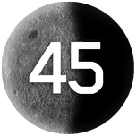&nbsp;
  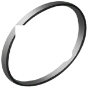

**Why offer it at all:** because what players want here pulls in two directions, and nothing forces a choice between them. Halo Wars 2 moved the series onto CSR tiers and that is the right modern answer — but a large part of this community never stopped wanting the classic **1–50**, the ladder they grew up climbing, where one number says what a tier badge cannot: Diamond 3 tells you roughly where you sit, a 43 tells you exactly. Nobody is actually arguing about the rating — **TrueSkill 2's accuracy is what everyone wants underneath** — only about how it is drawn. So the numbers are a display setting, not a second rating system: same CSR, same maths, same leaderboard position, shown as tiers or as 1–50, whichever you would rather wear.

Just like the original, the climb gets steeper near the top: ranks **1–44** cost about **36 CSR** each, ranks **45–49** cost **60**, and **50** opens at 1900 CSR. Here is the whole ladder against the tier system — every rank, its CSR, and the tier you wear at that rank:

| 1–50 rank | CSR | CSR tier |
|:--|:--|:--|
|  | 0&nbsp;–&nbsp;36 |  Bronze 1 |
|  | 37&nbsp;–&nbsp;72 |  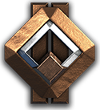 Bronze 1 – 2 |
|  | 73&nbsp;–&nbsp;109 |  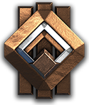 Bronze 2 – 3 |
|  | 110&nbsp;–&nbsp;145 |  Bronze 3 |
|  | 146&nbsp;–&nbsp;181 |  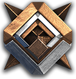 Bronze 3 – 4 |
|  | 182&nbsp;–&nbsp;218 |  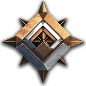 Bronze 4 – 5 |
|  | 219&nbsp;–&nbsp;254 |  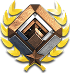 Bronze 5 – 6 |
| 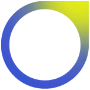 | 255&nbsp;–&nbsp;290 |  Bronze 6 |
|  | 291&nbsp;–&nbsp;327 |   Bronze 6 – Silver 1 |
|  | 328&nbsp;–&nbsp;363 |  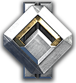 Silver 1 – 2 |
|  | 364&nbsp;–&nbsp;399 |  Silver 2 |
|  | 400&nbsp;–&nbsp;436 | 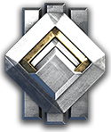 Silver 3 |
|  | 437&nbsp;–&nbsp;472 |  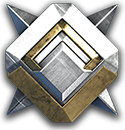 Silver 3 – 4 |
|  | 473&nbsp;–&nbsp;509 |  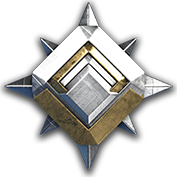 Silver 4 – 5 |
|  | 510&nbsp;–&nbsp;545 |  Silver 5 |
| 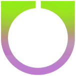 | 546&nbsp;–&nbsp;581 |  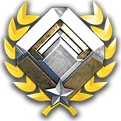 Silver 5 – 6 |
|  | 582&nbsp;–&nbsp;618 |   Silver 6 – Gold 1 |
|  | 619&nbsp;–&nbsp;654 |  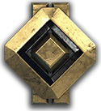 Gold 1 – 2 |
|  | 655&nbsp;–&nbsp;690 |  Gold 2 |
|  | 691&nbsp;–&nbsp;727 |  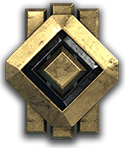 Gold 2 – 3 |
|  | 728&nbsp;–&nbsp;763 |  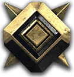 Gold 3 – 4 |
|  | 764&nbsp;–&nbsp;799 |  Gold 4 |
| 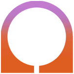 | 800&nbsp;–&nbsp;836 | 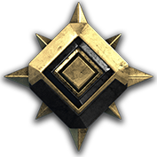 Gold 5 |
|  | 837&nbsp;–&nbsp;872 |  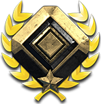 Gold 5 – 6 |
|  | 873&nbsp;–&nbsp;909 |   Gold 6 – Platinum 1 |
|  | 910&nbsp;–&nbsp;945 |  Platinum 1 |
|  | 946&nbsp;–&nbsp;981 |  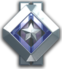 Platinum 1 – 2 |
|  | 982&nbsp;–&nbsp;1018 |  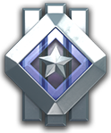 Platinum 2 – 3 |
| 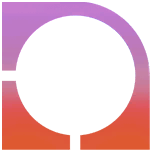 | 1019&nbsp;–&nbsp;1054 |  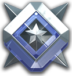 Platinum 3 – 4 |
|  | 1055&nbsp;–&nbsp;1090 |  Platinum 4 |
|  | 1091&nbsp;–&nbsp;1127 |  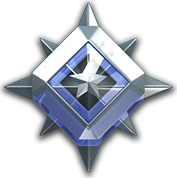 Platinum 4 – 5 |
|  | 1128&nbsp;–&nbsp;1163 |  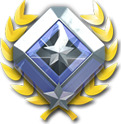 Platinum 5 – 6 |
|  | 1164&nbsp;–&nbsp;1199 |  Platinum 6 |
|  | 1200&nbsp;–&nbsp;1236 |  Diamond 1 |
|  | 1237&nbsp;–&nbsp;1272 |  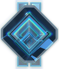 Diamond 1 – 2 |
|  | 1273&nbsp;–&nbsp;1309 |   Diamond 2 – 3 |
|  | 1310&nbsp;–&nbsp;1345 |  Diamond 3 |
|  | 1346&nbsp;–&nbsp;1381 |  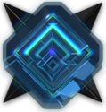 Diamond 3 – 4 |
| 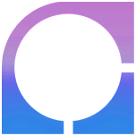 | 1382&nbsp;–&nbsp;1418 |  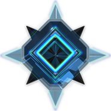 Diamond 4 – 5 |
|  | 1419&nbsp;–&nbsp;1454 |   Diamond 5 – 6 |
|  | 1455&nbsp;–&nbsp;1490 |  Diamond 6 |
|  | 1491&nbsp;–&nbsp;1527 |   Diamond 6 – Onyx |
|  | 1528&nbsp;–&nbsp;1563 |  Onyx |
| 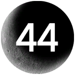 | 1564&nbsp;–&nbsp;1599 |  Onyx |
|  | 1600&nbsp;–&nbsp;1659 |  Onyx |
| 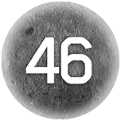 | 1660&nbsp;–&nbsp;1719 |  Onyx |
| 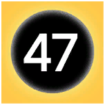 | 1720&nbsp;–&nbsp;1779 |  Onyx |
| 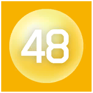 | 1780&nbsp;–&nbsp;1839 |   Onyx · **Champion** if top ten |
| 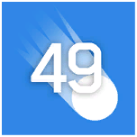 | 1840&nbsp;–&nbsp;1899 |   Onyx · **Champion** if top ten |
|  | 1900+ |   Onyx · **Champion** if top ten |

A rank that spans two sub-ranks (rank 2 is Bronze 1–2, for example) is simply one rank being wider than one 50-CSR sub-rank. **Champion** is not on this ladder as a rank of its own: from 1780 CSR — rank 48 — the top ten players on the board wear the Champion crest over their Onyx rating.

### Example: a new player's first session

1. You install the tool and play your first ranked 3v3 — you show as **rank 1 / CSR 0** (unproven, not "bad").
2. You win two games against mid-Gold opponents: the system learns fast — you jump to mid-Silver territory in one evening.
3. You lose to a Diamond team: barely moves you — losing to better players is expected and costs little.
4. Over the next ~10–20 games your uncertainty shrinks, the swings get smaller, and your rating settles where you actually play.

All of this is visible live on the **[stats site](https://halo-wars-definitive-edition-stats.pages.dev)**: full leaderboards, every player's rating history, and recent games with per-match rating changes.

---

## Where the data comes from

**Halo Wars: Definitive Edition has no official API** — no Halo Waypoint stats, no public match service, nothing to query. So as each ranked match ends, the overlay reads the match data directly from the running game's memory (map, teams, leaders, scores, duration — the same info as the post-game screen) and syncs it to the shared community database that powers the ladder and the [stats site](https://halo-wars-definitive-edition-stats.pages.dev). Every player in a match reports the same game independently and duplicates are merged, so the ladder stays consistent without any official service behind it.

---

## Joining the ladder

Downloading the overlay connects you to the community history immediately — the leaderboards fill in on first launch, and your finished matches upload automatically. **Being rated** is one step more: the ladder is an invite list (the Verified Roster), and a match moves ratings only when every player in it is verified — that's what keeps the board free of smurfs, farming, and fake results.

1. Open the overlay (**INSERT**) → **Verified Roster** tab → **Request to join** (it fills in your gamertag).
2. A community moderator approves the request — once you're on the roster, your ratings recompute automatically, **past games included**.
3. Until then your games are recorded and visible in Match History, they just don't move anyone's rating yet.

**Opting out entirely:** delete the `sync_server_url` and `sync_api_key` lines from `ms_trueskill_config.txt` next to the DLL — with them removed, the overlay is a purely local tracker and nothing is ever uploaded anywhere.

---

## Screenshots

**Match History** — every ranked game with map, teams, leaders, duration, and per-player rating changes:

  

*Player names in screenshots are replaced with placeholders. More screenshots coming soon.*

---

## Requirements

- Windows 10/11 (64-bit)
- **Halo Wars: Definitive Edition — Microsoft Store / Xbox app version** (the Steam version is not supported by this tool)
- **No administrator rights**

**Does it need administrator?** No — and no UAC prompt at any point. The Microsoft Store version of the game runs inside a Windows sandbox (an *AppContainer*), which is why the overlay has to be loaded into the game rather than simply run alongside it. That loading is done by an ordinary user-level program, and once loaded the overlay lives inside the game's own sandbox with no privileges of its own. It only reads match results and draws its interface; it does not modify gameplay or touch any game file.

---

## Installation

1. Download the latest release from the [Releases](../../releases) page and unzip it anywhere you like. Keep `HaloWarsStatsLoader.exe`, `MSTrueSkill.dll` and `ms_trueskill_config.default.txt` **together in the same folder**. (Your own settings file, `ms_trueskill_config.txt`, is created next to them on first launch.)
2. Double-click **`Install Auto-Load.bat`** once — no terminal, no prompt, no administrator. (Prefer the command line? `HaloWarsStatsLoader.exe --install` does the same thing.)
3. Start Halo Wars from the Xbox app as usual. The overlay appears by itself a few seconds in — press **INSERT** to show or hide it.

That is the whole setup. From then on it loads every time you play, and nothing is added to the game's own folder.

To stop it loading automatically, double-click `Uninstall Auto-Load.bat` (or run `HaloWarsStatsLoader.exe --uninstall`).

`HaloWarsStatsLoader.exe --status` shows what is currently set up, and `--inject` loads the overlay into a game that is already running if you would rather not install anything at all.

> Moving the folder after installing breaks it, because the autostart entry records the exact path. Run `--install` again from the new location.

---

## Updating

When a new version comes out, start clean. Nothing to merge, nothing to overwrite — two double-clicks and a delete:

1. Close Halo Wars.
2. In your **old** folder, double-click `Uninstall Auto-Load.bat`.
3. Delete the old folder.
4. Download the new release, unzip it anywhere, and double-click `Install Auto-Load.bat`.

**Your ratings and match history are safe.** They are not stored in that folder — the overlay keeps them elsewhere and picks them straight back up, and the community leaderboard is downloaded again on first launch either way.

The one thing you lose is your **in-game settings**, which go back to defaults. So if you had the lobby rank icons switched on, turn them back on once afterwards: **Settings → "Show CSR ranks on lobby players"**. It takes effect immediately, no restart.

---

## FAQ

**Is this a cheat?**
No. The overlay records match outcomes and displays ratings/statistics. It does not provide any gameplay advantage.

**Does it work with the Steam version?**
Not currently — this tool targets the Microsoft Store version.

**Where do the ratings come from?**
Every match is rated with the TrueSkill™ and TrueSkill 2 algorithms — the published rating systems designed for Xbox Live and Halo matchmaking, rewritten from the original research papers — over a shared community ladder. See [How the ratings work](#how-the-ratings-work) above, and browse the whole ladder on the [stats site](https://halo-wars-definitive-edition-stats.pages.dev).

**The game has no API — how do you get match data at all?**
The overlay records each match's results from your own game as it ends — see [Where the data comes from](#where-the-data-comes-from).

**How do I join the ranked ladder?**
The ladder uses a verified player roster to keep ratings fair. You can file a join request directly from the in-game overlay.

**Can my rating go down for losing to a much better player?**
Only slightly — both systems weigh results by how *surprising* they are. Losing to a favorite costs little; beating one pays a lot.

---

## Built with

- **[Dear ImGui](https://github.com/ocornut/imgui)** — the overlay's user interface. MIT License.
- **[MinHook](https://github.com/TsudaKageyu/minhook)** — the hooking library that lets the overlay draw inside the game. BSD 2-Clause License.
- **TrueSkill™ / TrueSkill 2** — rating engines implemented from scratch from the published Microsoft Research papers ([TrueSkill](https://www.microsoft.com/en-us/research/publication/trueskilltm-a-bayesian-skill-rating-system/), [TrueSkill 2](https://www.microsoft.com/en-us/research/publication/trueskill-2-improved-bayesian-skill-rating-system/)). The TrueSkill 2 paper transcription and Python reference implementation are published in [reference/](reference/).

Full license texts for bundled open-source components ship alongside every binary release (`licenses\` in the zip).

---

*This tool is free software distributed as-is; all rights reserved. Not affiliated with Microsoft, Xbox Game Studios, or 343 Industries / Halo Studios. Halo Wars is a trademark of Microsoft Corporation.*

**Revived by Hysterically.**
